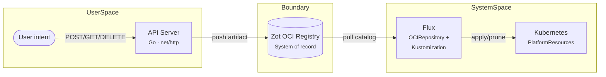

# GitOps Squared

A proof of concept that replaces Git as the system boundary between user intent and infrastructure reconciliation with an OCI registry.



Users declare intent through an API. The API converts that intent into versioned OCI artifacts stored in a Zot registry. Flux watches the registry and reconciles artifacts into Kubernetes resources. The OCI registry is the single system of record — no Git repository, no database.

## How it works

1. A user sends a resource declaration to the API (`POST /api/v1/resources`)
2. The API server converts it to a Kubernetes CRD manifest, pushes it as an OCI artifact to Zot, and rebuilds a catalog tarball containing all current resources
3. Flux's OCIRepository source detects the updated catalog digest and pulls the tarball
4. Flux's Kustomization applies the manifests to the cluster
5. On delete, the resource is removed from the catalog — Flux's `prune: true` removes it from the cluster

Each resource is also stored as an individual OCI artifact (`gitops-squared/resources/<namespace>/<name>`) with immutable version tags for audit trail. The catalog (`gitops-squared/catalog:latest`) is the Flux-consumable aggregate view.

## Prerequisites

- [Go](https://go.dev/) 1.24+
- [Docker](https://www.docker.com/)
- [kind](https://kind.sigs.k8s.io/)
- [kubectl](https://kubernetes.io/docs/tasks/tools/)
- [jq](https://jqlang.github.io/jq/) (for the demo script)

## Quick start

```bash
# Create the kind cluster with Zot, API server, and Flux
make setup

# In one terminal — expose the API
make port-forward

# In another terminal — run the demo
make demo
```

To tear everything down:

```bash
make teardown
```

## API

All resources use the `default` namespace. The API server listens on port 8080.

### Create or update a resource

```bash
curl -X POST http://localhost:8080/api/v1/resources \
  -H "Content-Type: application/json" \
  -d '{
    "name": "web-server",
    "spec": {
      "type": "vm",
      "size": "medium",
      "region": "us-east-1",
      "replicas": 2
    }
  }'
```

Response:

```json
{
  "name": "web-server",
  "version": "v1770731425",
  "digest": "sha256:866bab...",
  "repository": "gitops-squared/resources/default/web-server",
  "spec": {
    "type": "vm",
    "size": "medium",
    "region": "us-east-1",
    "replicas": 2
  }
}
```

### List resources

```bash
curl http://localhost:8080/api/v1/resources
```

### Get a resource

```bash
curl http://localhost:8080/api/v1/resources/web-server
```

### Delete a resource

```bash
curl -X DELETE http://localhost:8080/api/v1/resources/web-server
```

After ~10 seconds, Flux reconciles and the resource appears in (or is pruned from) the cluster:

```bash
kubectl get platformresources -o wide
```

## Resource types

The `PlatformResource` CRD supports these spec fields:

| Field | Values | Required |
|-------|--------|----------|
| `type` | `vm`, `database`, `bucket` | yes |
| `size` | `small`, `medium`, `large` | yes |
| `region` | any string | no |
| `replicas` | 1–10 | no (default: 1) |

## Project structure

```
cmd/api/                  API server entrypoint
internal/
  api/handler.go          HTTP handlers (CRUD)
  api/catalog.go          Catalog manager — builds tar.gz for Flux
  oci/client.go           OCI push/pull/list via oras-go
  oci/mediatype.go        Media type constants
  model/resource.go       PlatformResource model and validation
deploy/
  api/                    API server Deployment + Service
  zot/                    Zot registry Deployment + Service
  crd/                    PlatformResource CRD
  flux/                   OCIRepository + Kustomization
scripts/
  setup.sh                Bootstrap kind + Zot + API + Flux
  teardown.sh             Delete everything
  demo.sh                 End-to-end curl walkthrough
```

## OCI artifact format

Each resource is stored as an individual artifact:

```
zot:5000/gitops-squared/resources/default/<name>:latest
zot:5000/gitops-squared/resources/default/<name>:v<timestamp>
```

The catalog is a tar.gz containing all current manifests plus a `kustomization.yaml`:

```
zot:5000/gitops-squared/catalog:latest
  manifests/
    default-web-server.yaml
    default-app-db.yaml
    kustomization.yaml
```

Custom media types:

- Artifact type: `application/vnd.gitops-squared.resource.v1`
- Resource layer: `application/vnd.gitops-squared.manifest.v1+yaml`
- Catalog layer: `application/vnd.cncf.flux.content.v1.tar+gzip`

## What this is not

This is a thought experiment, not production software. It does not include authentication, multi-tenancy, TLS, status back-propagation, garbage collection, or high availability. The goal is to demonstrate that an OCI registry can serve as the system boundary between user intent and infrastructure reconciliation.

## Background

See [GitOps Squared](https://alfredtm.github.io/gitops-squared) for the full motivation behind this architecture.
